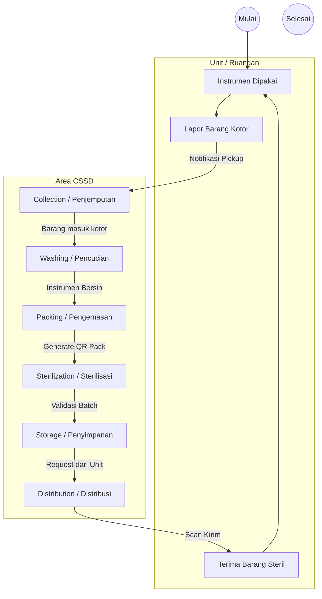
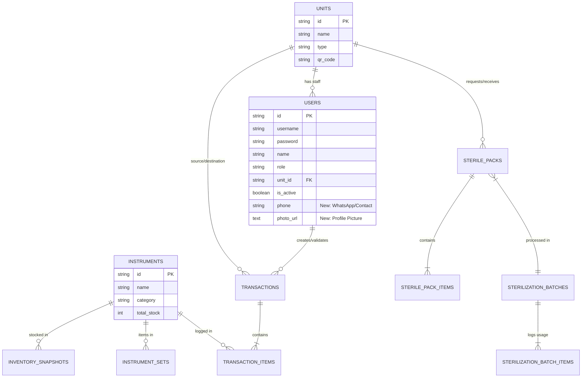

# SteriTrack - System Diagrams

## 1. Use Case Diagram
Diagram ini menggambarkan interaksi antara Aktor (User) dengan Sistem.

```mermaid
usecaseDiagram
    actor "Perawat (Nurse)" as Nurse
    actor "Staf CSSD" as CSSD
    actor "Admin" as Admin

    package "SteriTrack System" {
        usecase "Login" as UC1
        usecase "Scan QR Unit / Pasien" as UC2
        usecase "Request Instrumen" as UC3
        usecase "Kembalikan Instrumen Kotor (Return)" as UC4
        
        usecase "Terima Barang Kotor (Collection)" as UC5
        usecase "Cuci & Dekontaminasi" as UC6
        usecase "Packing & Labeling" as UC7
        usecase "Sterilisasi (Autoclave)" as UC8
        usecase "Distribusi ke Unit" as UC9
        
        usecase "Manajemen User" as UC10
        usecase "Manajemen Master Data" as UC11
        usecase "Lihat Laporan" as UC12
    }

    Nurse --> UC1
    Nurse --> UC2
    Nurse --> UC3
    Nurse --> UC4

    CSSD --> UC1
    CSSD --> UC5
    CSSD --> UC6
    CSSD --> UC7
    CSSD --> UC8
    CSSD --> UC9

    Admin --> UC1
    Admin --> UC10
    Admin --> UC11
    Admin --> UC12
```

## 2. Activity Diagram (Siklus Instrumen)
Diagram ini menggambarkan alur kerja siklus hidup instrumen dari kotor hingga steril kembali.



## 3. Entity Relationship Diagram (ERD) - Conceptual
Diagram hubungan antar tabel database.


