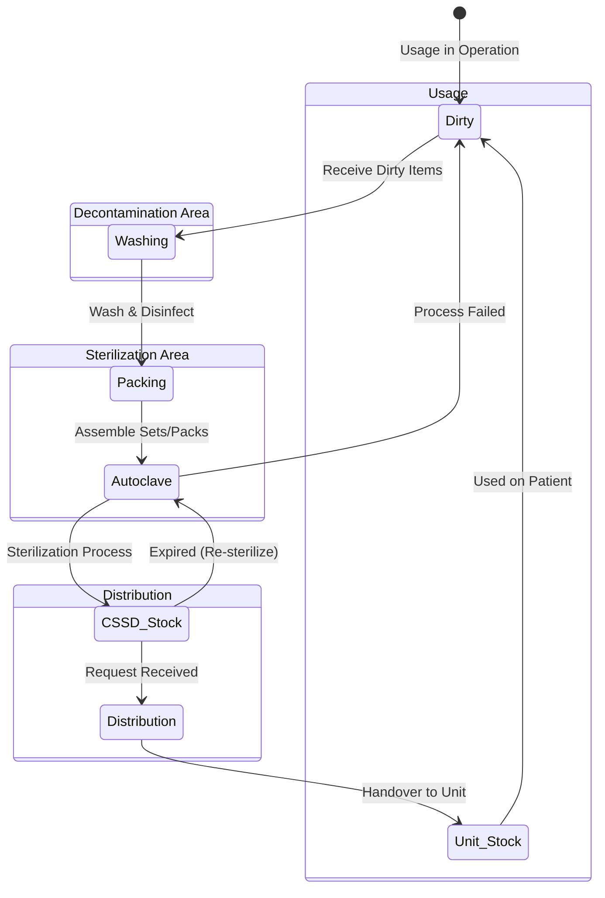
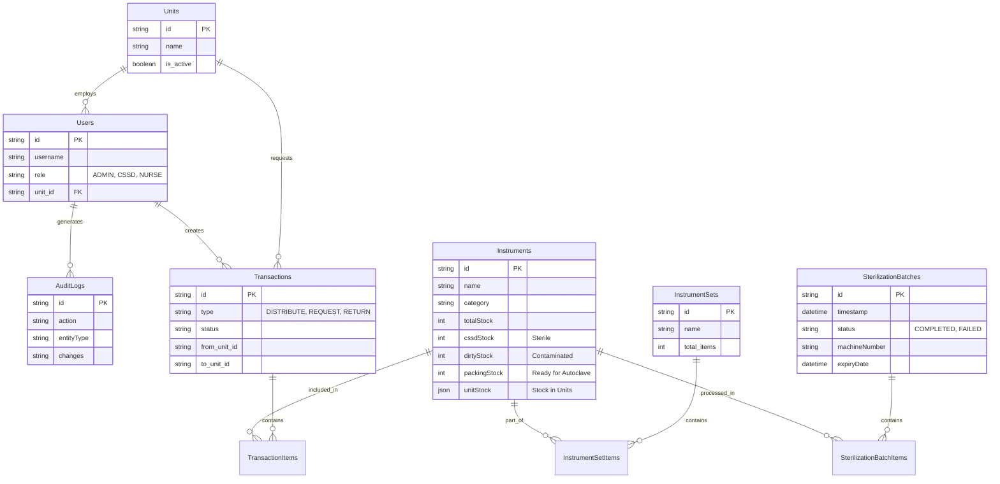

# System Architecture & Design Document - SteriTrack CSSD

This document provides a comprehensive technical overview of the SteriTrack CSSD (Central Sterile Services Department) application, including system architecture, UML diagrams, and workflow analysis.

---

## 1. System Architecture

SteriTrack is built on a modern **Client-Server Architecture** designed for scalability, performance, and ease of maintenance.

### **High-Level Architecture Diagram**

```mermaid
graph TD
    UserClient[Web Browser (Client)]
    
    subgraph Frontend [Frontend Application]
        React[React.js App (Vite)]
        State[Context API State Management]
        UI[Tailwind CSS UI]
    end
    
    subgraph Backend [Backend Server]
        Node[Node.js Runtime]
        Express[Express.js Framework]
        Auth[JWT Middleware]
        Controllers[API Controllers]
    end
    
    subgraph Database [Data Storage]
        MySQL[(MySQL Database)]
    end

    UserClient <--> React
    React <-->|REST API (JSON)| Express
    Express <-->|SQL Queries| MySQL
```

### **Technology Stack**
*   **Frontend:** React (Vite) + TypeScript
    *   **Styling:** TailwindCSS
    *   **Icons:** Lucide-React
    *   **State Management:** React Context API + React Query
*   **Backend:** Node.js
    *   **Framework:** Express.js
    *   **Security:** Helmet, Rate Limiter, CORS
*   **Database:** MySQL
    *   **Driver:** mysql2/promise (Connection Pooling)

---

## 2. Use Case Diagram

This diagram references the actors and their interactions with the major modules of the system.

```mermaid
usecaseDiagram
    actor Admin as "Admin"
    actor CSSD as "CSSD Staff"
    actor Nurse as "Nurse (Unit)"

    package "SteriTrack System" {
        usecase "Login & Authentication" as UC1
        usecase "Manage Users & Units" as UC2
        usecase "Manage Instrument Master Data" as UC3
        usecase "Washing & Decontamination" as UC4
        usecase "Packing & Set Assembly" as UC5
        usecase "Sterilization Process" as UC6
        usecase "Distribute Instruments" as UC7
        usecase "Request Sterile Items" as UC8
        usecase "View Reports & Audit Logs" as UC9
    }

    Admin --> UC1
    Admin --> UC2
    Admin --> UC3
    Admin --> UC9
    
    CSSD --> UC1
    CSSD --> UC4
    CSSD --> UC5
    CSSD --> UC6
    CSSD --> UC7
    CSSD --> UC9
    
    Nurse --> UC1
    Nurse --> UC8
    Nurse --> UC7
```

**Actor Descriptions:**
*   **Admin:** Full system access, manages configuration, users, and master data.
*   **CSSD Staff:** Responsible for the operational loop (Cleaning -> Sterilization -> Distribution).
*   **Nurse:** Initiates requests for instruments and receives stock into their specific Units.

---

## 3. Activity Diagram (Main Sterilization Workflow)

This diagram details the core lifecycle of a medical instrument within the system.



**Key Phases:**
1.  **Decontamination:** Collecting dirty instruments and washing them (moving stock from `Dirty` to `Packing`).
2.  **Assembly & Packaging:** Preparing instruments into sets or pouches.
3.  **Sterilization:** Running autoclave batches. Success moves stock to `CSSD Stock` (Sterile); Failure returns it to `Dirty`.
4.  **Distribution:** Transferring sterile stock to specific Hospital Units (e.g., ER, ICU), moving stock to `Unit Stock`.

---

## 4. Class Diagram (Data Model)

This diagram represents the database schema and the relationships between entities.



## 5. Key Design Patterns & Principles

1.  **Separation of Concerns:**
    *   **Frontend:** Handles UI rendering and user interaction only. Contains no business logic regarding stock calculations.
    *   **Backend:** The "Source of Truth". Handles all stock calculations, validation, and database integrity.

2.  **Transactional Integrity:**
    *   Critical operations (like Sterilization and Washing) use database transactions (Commit/Rollback) to ensure stock numbers never drift. For example, stock is only deducted from "Packing" if it is successfully added to "Sterile".

3.  **Optimistic UI with React Query:**
    *   The frontend uses React Query to cache server data. When a mutation occurs, the UI is invalidated and refetched to ensure users always see the latest stock levels without manual refreshing.

4.  **Modular Service Layer:**
    *   The `TransactionController` and `SterilizationController` encapsulate complex logic, keeping API routes clean and readable.

